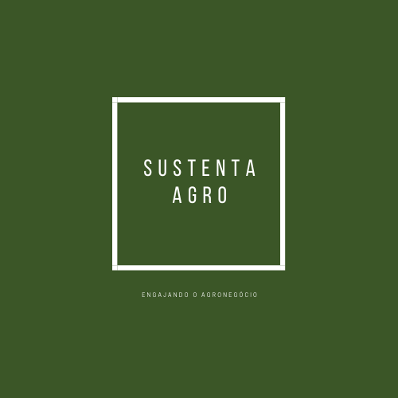

<h1 align="center">
    
</h1>

<h2 align="center"> O projeto SustentaAgro foi desenvolvido para o desafio 6 de engajamento em práticas sustentáveis do Hackathon Aibalab. </h2>

## Sobre

## Time

- [Ernando Donato](https://www.linkedin.com/in/ernando-donato/)
- [Luiz Augusto](https://www.linkedin.com/in/luiz-augusto-penas-de-britto-3279b418/)
- [Leonardo Sena](https://www.linkedin.com/in/leosena21/)
- [Natália Martins](http://linkedin.com/in/natália-martins-b82950198)

## Desenvolvimento

O projeto SustentaAgro foi desenvolvido utilizando IONIC jutamente com o Typescript, além de utilizar HTML e CSS para toda a estrutura da página. 
Para inicializar o projeto é preciso utilizar os comandos abaixo:

### `npm install`
### `ionic cordova run browser`
